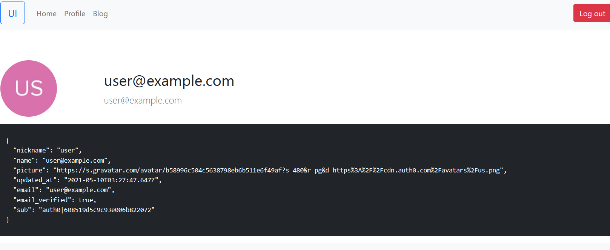
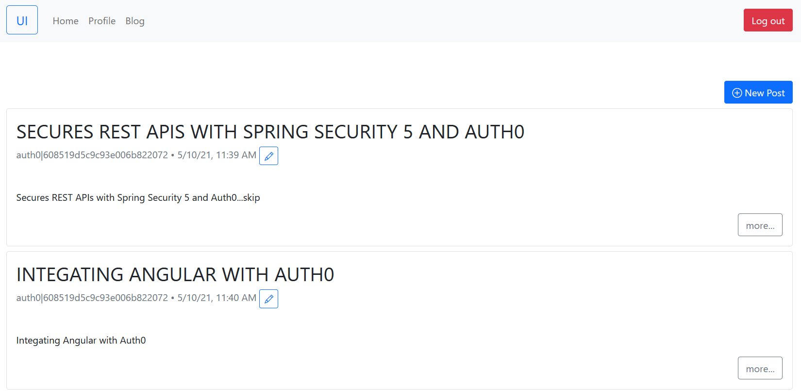

# Integrating Auth0 into your Angular applications

Auth0 provides SDK for Angular to authenticate users and simply authorize users to access the protected APIs .

In this post, we will create a simple Angular SPA application and try to access the *Backend API* we have created in [the last post](https://hantsy.medium.com/secures-rest-apis-with-spring-security-5-and-auth0-41d579ca1e27).

Firstly lets create a new application in the Auth0 management console. An application presents an OAuth2 *Client* role , each client should have a unique client id to identify it.

In the dashboard UI,  expand *Applications/applications* in the left pane. Click the *Create Application* button to start up the creating progress.

*  In the application name, set a name for  this new  Angular application, eg.  I used *spa*  here. 
*  Then select the *Single page applications*.
* Click the *Create* button.

After it is created, open the *Settings* page, you will find a  *Client ID* and  *Client Secrets*  are generated in the page.  In the  *Application URLs* section, add *http://localhost:4200* to the following fields.

*  *Allowed Callback URLs*  
*  *Allowed Logout URLs* 
* *Allowed Web Origins*
* *Allowed Origins (CORS)*

In the *Quickstarts* tab, Auth0 provides a series of tutorials to integrate Auth0 with the popular SPA framework, including  Angular/React/Vue, etc.

I followed the official Angular Quickstart tutorial, but I refactored the project file structure according to the  [Angular Coding Style Guide](https://angular.io/guide/styleguide), and ported the existing codes from [hantsy/angular-spring-reactive-sample](https://github.com/hantsy/angular-spring-reactive-sample) to simplify the development work. The final [source codes]((https://github.com/hantsy/spring-security-auth0-sample/tree/master/ui)) can be found under my Github account.

> More details about creating this sample application step by step, please read the [official Angular Quickstart tutorial](https://auth0.com/docs/quickstart/spa/angular).

> For the implementation details of accessing Backend APIs, check [this article I have published on Medium](https://hantsy.medium.com/build-a-reactive-application-with-spring-boot-2-0-and-angular-de0ee5837fed) and this old [Angular2 sample codes](https://github.com/hantsy/angular2-sample).

Here we are going to introduce the details of integrating Auth0 Angular SDK.

Install Auth0 Angular SDK.

```bash 
$ npm i @auth0/auth0-angular
```

Auth0 Angular SDK provides a series of authentication related facilities out of box, including `AuthModule`, `AuthService` , `AuthGuard` and  `AuthHttpInterceptor` .  We have built those components from scratch in the  [hantsy/angular-spring-reactive-sample](https://github.com/hantsy/angular-spring-reactive-sample).

Configure `AuthModule`  and `AuthHttpInterceptor`  in the *app.module.ts*.

```typescript
// Import the module from the SDK
import { AuthHttpInterceptor, AuthModule } from '@auth0/auth0-angular';

@NgModule({
  declarations: [AppComponent],
  imports: [
    BrowserModule,
    BrowserAnimationsModule,
    CoreModule,
    SharedModule,
    // Import the module into the application, with configuration
    AuthModule.forRoot({
      domain: 'dev-ese8241b.us.auth0.com',
      clientId: 'xwulkQN219vK2LU9MKowCo0HQLRi0WQU',
      audience: 'https://hantsy.github.io/api',
      scope: 'openid profile email read:posts write:posts delete:posts',
      // The AuthHttpInterceptor configuration
      httpInterceptor: {
        allowedList: [
          '/api/*',
        ],
      },
    }),
    HomeModule,
    AppRoutingModule,
  ],
  providers: [
    {
      provide: HTTP_INTERCEPTORS,
      useClass: AuthHttpInterceptor,
      multi: true,
    },
  ],
  bootstrap: [AppComponent],
})
export class AppModule {}
```

Let's have a look at the content of `AppRoutingModule`.  In the path of profile module and admin module, add a `AuthGuard` to ensure the current user is authenticated.

```typescript
import { AuthGuard } from '@auth0/auth0-angular';
//...

const routes: Routes = [
  { path: '', redirectTo: '/home', pathMatch: 'full' },
  {
    path: 'profile',
    loadChildren: () =>
      import('./profile/profile.module').then((m) => m.ProfileModule),
    canActivate: [AuthGuard],
  },
  {
    path: 'posts',
    loadChildren: () =>
      import('./posts/posts.module').then((m) => m.PostsModule),
  },
  {
    path: 'admin',
    loadChildren: () =>
      import('./admin/admin.module').then((m) => m.AdminModule),
    canActivate: [AuthGuard],
  },
  //{ path: '**', component:PageNotFoundComponent}
];

@NgModule({
  imports: [RouterModule.forRoot(routes)],
  exports: [RouterModule],
})
export class AppRoutingModule {}
```

To show/hide the login and log out button, inject an `AuthService` and detect the authentication status via its `isAuthenticated` method.

```typescript
export class AuthenticationButtonComponent implements OnInit {
  constructor(public auth: AuthService) {}

  ngOnInit(): void {}
}
```
The template file of `AuthenticationButtonComponent`.

```html
<app-login-button *ngIf="(auth.isAuthenticated$ | async) === false">
</app-login-button>

<app-logout-button *ngIf="auth.isAuthenticated$ | async">
</app-logout-button>
```

To test the application, we have to add some testing users in Auth0(you can also use *Signup* form to register a user).

Go to Auth0 management console.  Expand the *Authentication/Databases* in the left pane, we will use the default *Username-Password-Authentication* here, click the options button to open *Settings* page, make sure *Requires Username* is checked, I would like to use a username instead of email to login. Switch to *Password Policy*  tab, make *Password strength* lower, it allows you to create simple passwords for your testing users.  Switch to the *Applications* tab, make sure your application is activated there.

Let's  add some users now.   Open *User management/Users* in the dashboard. Click  *Create User* to start adding new users. Add the following new users(username/password/email), and assign permissions to them.

* user/password/user@example.com - read:posts, write:posts
* admin/password/admin@example.com - read:posts, write:posts, delete:posts

Go to the user details page of every users, under the email, mark the email as verified directly to avoid email verification.

Now back to your application,  run the following command to start it.

```bash
$ npm run start
```

Click login button to show the Auth0 Login Form, input the user/password to login.

Navigate to the *Profile* page, you will see the screen similar to the following.



The blog accesses the *Backend API* we have created. To experience it, make sure the Backend API is running.



Try to log out, it should return to the *http://localhost:4200*.

Grab the source codes form my [Github](https://github.com/hantsy/spring-security-auth0-sample/tree/master/ui).